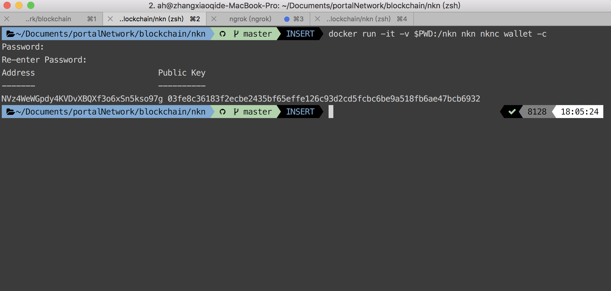
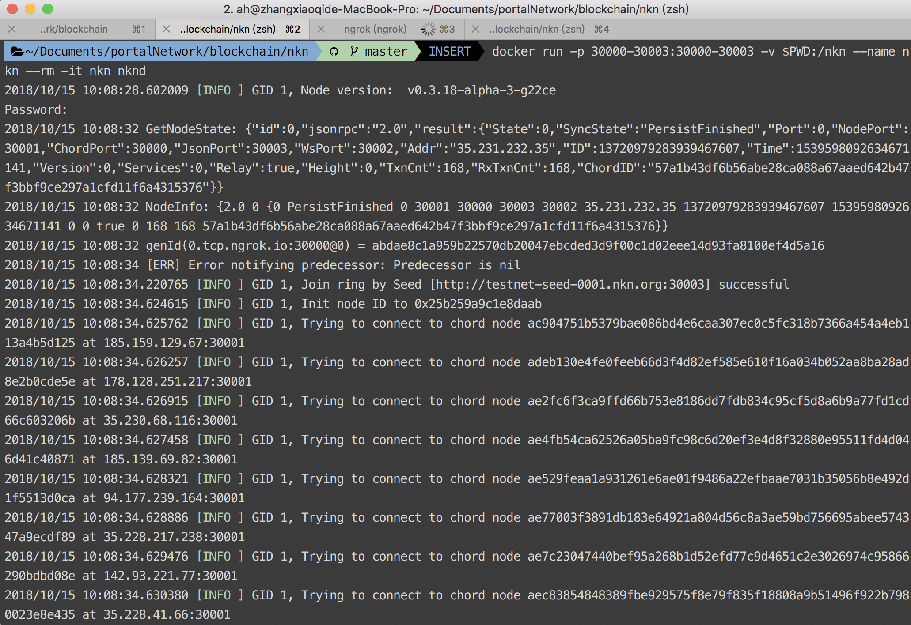

# NKN local node deployment using docker

## Prerequisites

- Clone NKN project.
```
git clone https://github.com/nknorg/nkn.git
```
- `Docker` installed.

## Build using docker

1. Change current directory to `nkn` project.
```
cd nkn
```

2. Build dokcer image.
```
docker build -t nkn .
```

3. After docker image built successfully, we need to prepare a configuration file for starting a node. There are two default configuration files in `nkn` project:
- `config.testnet.json`: used to join the testnet.
- `config.local.json`: create and join a private chain on your localhost.
In this tutorial, we want to make our own node become part of the testnet, so we will choose `config.testnet.json` as configuration file.
    ```
    cp config.testnet.json config.json
    ```
    And open the `config.json` file:

    - Replace `Hostname` with your IP address.
    ### Note:
    NKN needs a public static IP or set up [port forwarding](https://portforward.com/) on your router properly to join the testnet.

4. Before starting the node, we need to create a new wallet first:
```
docker run -it -v $PWD:/nkn nkn nknc wallet -c
```


5. After wallet created, we can start to deploy local node:
```
docker run -p 30000-30003:30000-30003 -v $PWD:/nkn --name nkn --rm -it nkn nknd
```


## Reference
[NKN github](https://github.com/nknorg/nkn#building-using-docker)