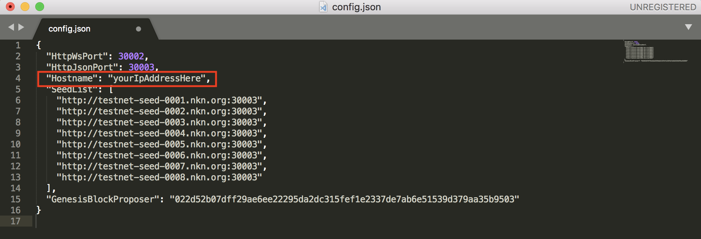
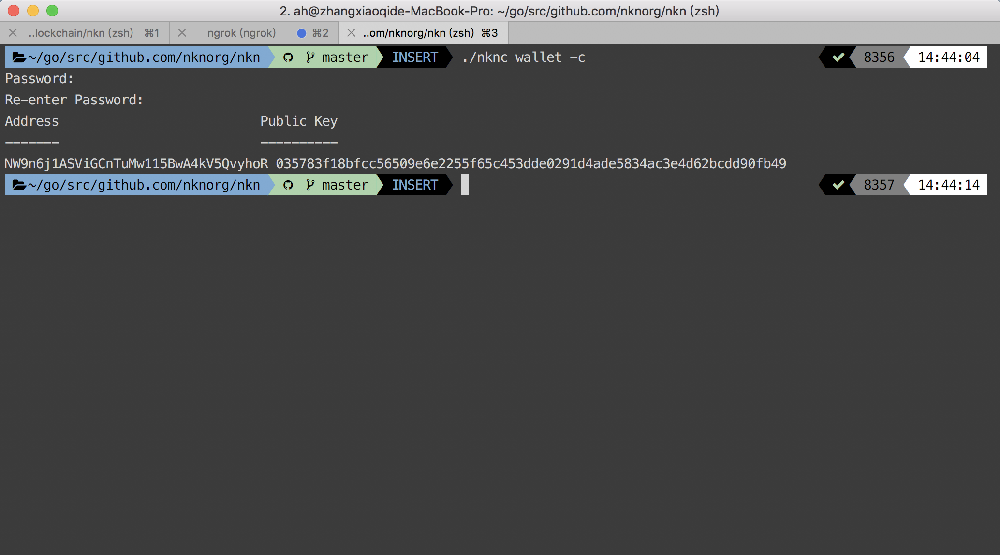
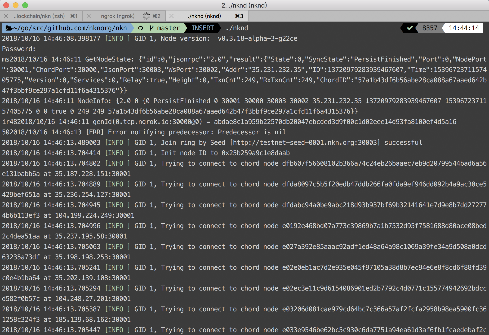

# NKN local node building from source code

## Prerequisites

- [Go 1.10+](https://golang.org/doc/install) installed.

- `$GOROOT` and `$GOPATH` environment variable configured.
    ```
    export GOROOT=$(go env GOROOT)
    export GOPATH=$(go env GOPATH)
    export GOBIN=$GOPATH/bin
    export PATH=$PATH:$GOBIN
    ```

- Create directory $GOPATH/src/github.com/nknorg/ if not exists.
    ```
    mkdir -p $GOPATH/src/github.com/nknorg
    ```


## Building from source

1. Clone [nkn](https://github.com/nknorg/nkn) project to `$GOPATH/src/github.com/nknorg/`.
```
cd $GOPATH/src/github.com/nknorg/
git clone https://github.com/nknorg/nkn.git
```

2. Install package management tool `glide`.
```
cd nkn
make glide
```

3. Download dependency module and build project.
```
make vendor
make
```

4. After source code built successfully, we need to prepare a configuration file for starting a node. There are two default configuration files in `nkn` project:
- `config.testnet.json`: used to join the testnet.
- `config.local.json`: create and join a private chain on your localhost.
In this tutorial, we want to make our own node become part of the testnet, so we will choose `config.testnet.json` as configuration file.
    ```
    cp config.testnet.json config.json
    ```
    And open the `config.json` file:

    - Replace `Hostname` with your IP address.
    ### Note:
    NKN needs a public static IP or set up [port forwarding](https://portforward.com/) on your router properly to join the testnet.

5. Before starting the node, we need to create a new wallet first:
```
./nknc wallet -c
```


6. After wallet created, we can start to deploy local node:
```
./nknd
```


## Reference
[NKN github](https://github.com/nknorg/nkn#building-using-docker)